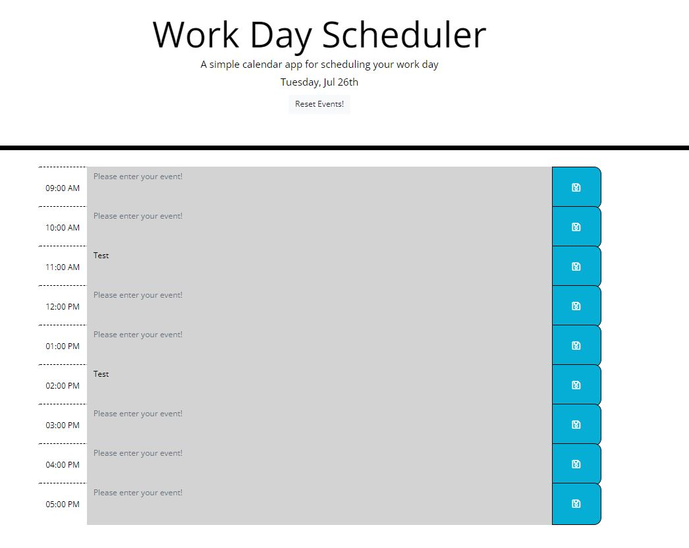

# Work Day Scheduler Starter Code

## Description
This assignment is about creating a simple calendar application that allows a user to save events for each hour of the day. The application will run in the browser and feature dynamically updated HTML and CSS powered by jQuery.

## Criteria for building calendar application
* Opening the calendar should display current day at the top of the calendar.
* Scrolling down should present the users with the time blocks for standard business hours.
* When users view the time blocks for the day, each time block should be color-coded to indicate whehter it is in the past, present, or future.
* Clicking into a time block should enter an event.
* Clicking the save button for that time block should save the event in the local storage.
* Refreshing the page should saved the events persist.

## Steps taken to build calendar application
* Clond the starter code repository without forking the starter code repository [Link To Starter Code](https://github.com/coding-boot-camp/super-disco)
* Create various div tags and apply bootstrap classes to apply correct styles for each time blocks.
    * Assign correct id for each time block. 
        * For example, for 09:00 AM I gave the textarea id of 9am to make sure that block is only for 09:00 AM.
* Refactor css file to make the HTML page look more appropriate.
    * Example I: Applied width and padding to make borders don't overlap each other.
    * Example II: Changed color style and font-size to make users view the application easily.
* Created functions and assigned new variables by calling ids assigned in HTML to JavaScript to make webpage interactive and provide functionality.
* Check if the application works properly and check if all criterias were met.
* Comment codes in JavaScript to explain what each lines do.
* Finally, created a repository for the challenge and pushed all necessary files for this challenge!

## Screenshot of the application and Link to deployed application
* [Link to the deployed application](https://hhealing123.github.io/Third-Party-APIs-Challenge-Work-Day-Scheduler-/)
* Screenshot of the application

## Video Demo of Calendar Application!
* [Video Demo Link](https://user-images.githubusercontent.com/106945679/181139665-c181c291-e9da-4939-a43e-1f4482743781.mp4)

## Challenging Moments and Final Thoughts!
* This week's assignment was fairly easy. I understood exactly what I was doing such as importing jQuery and Moment.js to make those function in the HTML page. However, I did have a hard time when I was styling HTML/CSS files; simply due to the fact that I was not aware that I had to use bootstrap when assigning classes for some of the divs in HTML; hence, I had to do little research on how to properly apply bootstrap into HTML.

## Utilized References
* https://getbootstrap.com/docs/4.0/components/input-group/
* https://getbootstrap.com/docs/4.0/components/jumbotron/
* https://getbootstrap.com/docs/4.0/components/forms/